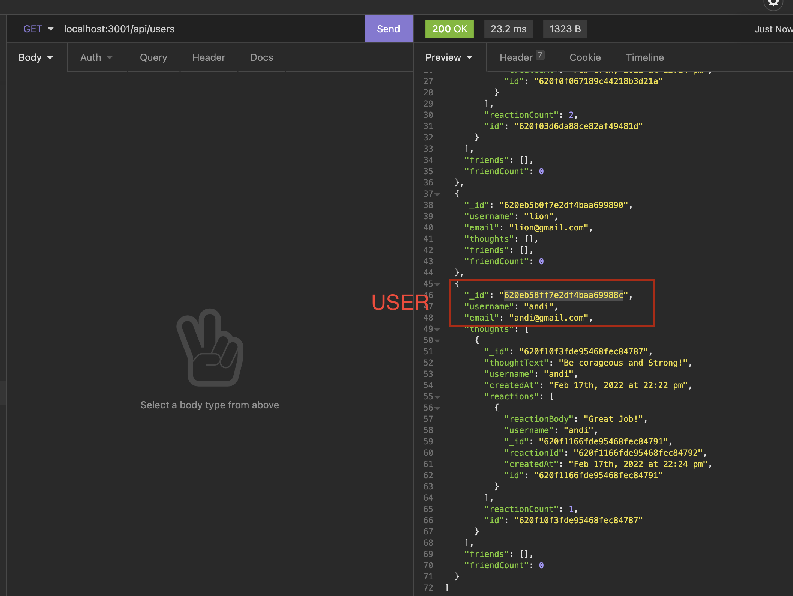
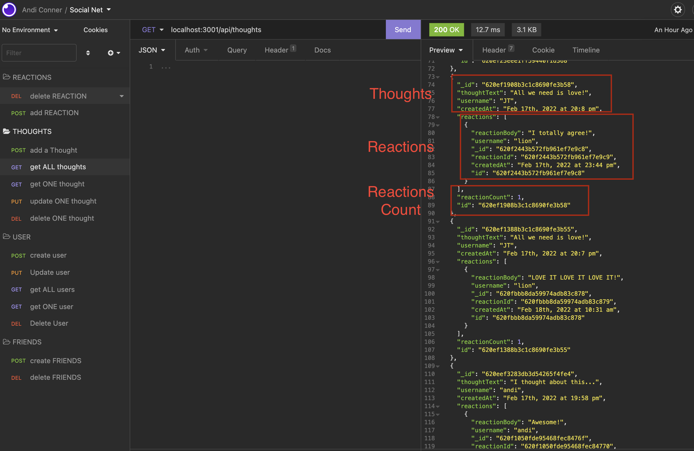
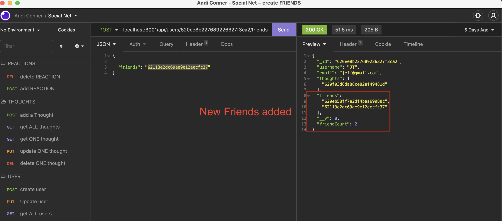

# social-net
Module 18 challenge. NoSQL - MongoDB, mongoose - Social Network API

## Description 
This challenge is to build an API for a social network web application where users can share their thoughts, react to friends’ thoughts, and create a friend list.

## Table of Contents

* [Usage](#usage)
* [User Story](#userStory)
* [Installation](#installation)
* [Screenshots](#screenshots)
* [Questions](#questions) 

## Usage 
MongoDB is a popular choice for many social networks due to its speed with large amounts of data and flexibility with unstructured data.  The foundation of these applications is data, it’s important to understand how to build and structure the API first.

## User Story
AS A social media startup
I WANT an API for my social network that uses a NoSQL database
SO THAT my website can handle large amounts of unstructured data

## Instalation
-	Clone https://github.com/andiconner/social-net.git
-   Run npm i express mongoose to install all of the dependencies;
-	On the terminal command-line type “npm start” to start the app;
-	Go to Insomnia to test the routes.
- [Walkthrough Video](https://watch.screencastify.com/v/aSXEhulOgFXbyJ9v7ITL)

## Screenshots

Here are some images showing the app routes tested in Insomnia:

User

Thoughts-routes

Adding a Friend to a user's friend list

## Questions
If you have any questions about the repo, please send an [email](mailto:andiconner@icloud.com). You can find more of my work at  [my gitub profile page](https://github.com/andiconner)

